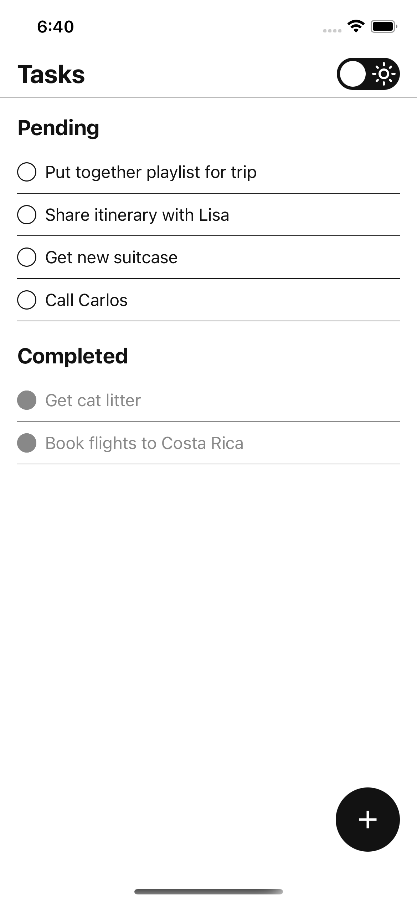
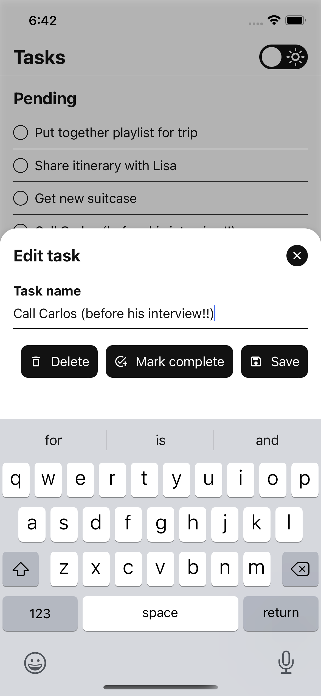
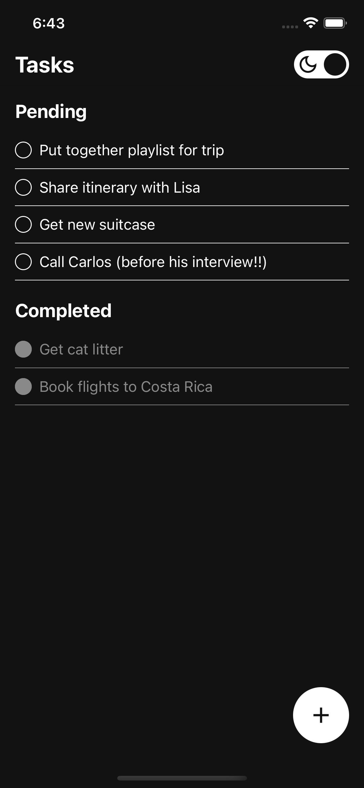

# TasksRN - A task list demo app
App built with React Native for iOS and Android. It mainly demonstrates:
- Global state management implemented with useReducer + useContext hooks
- A minimal design system with theming capabilities
- React Navigation with a stack navigator and custom modals
- TypeScript

# Screenshots

